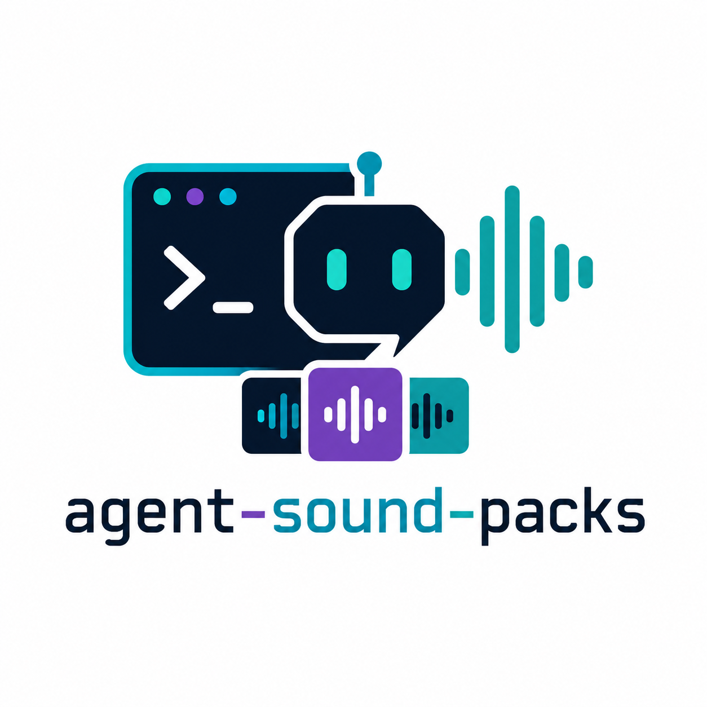

<p align="center">
  
</p>

<h1 align="center">agent-sound-packs</h1>

<p align="center">
  <a href="LICENSE"></a>
  
  
  
  
  <a href="https://claude.com/claude-code"></a>
  <a href="https://github.com/openai/codex"></a>
  <a href="https://github.com/Aider-AI/aider"></a>
</p>

<p align="center">
  <strong>Your AI coding agent talks back.</strong><br>
  Themed sound packs that play short clips when your agent finishes a task, needs input, or hits other lifecycle events. Drop in any folder of <code>.wav</code> files, map each event to its own sound pool, switch themes in one command.
</p>

<p align="center">
  Works with <a href="https://claude.com/claude-code">Claude Code</a> · <a href="https://github.com/openai/codex">Codex CLI</a> · <a href="https://github.com/Aider-AI/aider">Aider</a> · any agent CLI with a post-turn hook.
</p>

---

## In one breath

Five canonical events (`stop` · `notification` · `subagent` · `session` · `compact`) fire randomized audio cues from the active pack. Two scripts, one config file per pack, no daemon, no runtime. Eleven example packs included (Mortal Kombat, Futurama, Ace Ventura, Commander Keen, DBZ, Looney Tunes, Pinky and The Brain, The Simpsons, Duke Nukem, CS Hostage, CoD Modern Warfare); add your own in 30 seconds.

> This repository bundles short third-party audio samples as illustrative example packs. Samples are very short (~1-3 seconds), used as functional UI feedback, attributed to their original creators. If you fork this repo for public redistribution, consider swapping in audio you own or have a license to redistribute.

---

## Table of contents

- [Features](#features)
- [Requirements](#requirements)
- [Install](#install)
- [Tool integrations](#tool-integrations)
- [Event model](#event-model)
- [Quick usage](#quick-usage)
- [Adding a new pack](#adding-a-new-pack)
- [Pack format](#pack-format)
- [Switching packs](#switching-packs)
- [Testing](#testing)
- [Transcribing audio](#transcribing-audio)
- [Architecture](#architecture)
- [Adapting the player](#adapting-the-player)
- [Troubleshooting](#troubleshooting)
- [For agents / bots](#for-agents--bots)
- [Contributing](#contributing)
- [License](#license)

---

## Features

- **Tool-agnostic event model** — five canonical events, mapped per tool via thin adapters.
- **Per-event sound pools** — each pack defines which sounds belong to which event.
- **Random pick per fire** — variety across repeated events.
- **Hot-swappable packs** — change theme in one command, no restart.
- **Pluggable packs** — add a pack by dropping wavs in a directory with a `pool.conf` next to them.
- **No-spam by design** — per-tool-call hooks deliberately not exposed.
- **Transcribe helper** — bundled whisper.cpp wrapper to label a pack by what each clip actually says.

---

## Requirements

- macOS (uses `afplay`). Linux/Windows ports straightforward — see [Adapting the player](#adapting-the-player).
- At least one supported coding-agent CLI installed.
- Optional: [whisper.cpp](https://github.com/ggerganov/whisper.cpp) for the transcribe helper.

---

## Install

```bash
git clone https://github.com/foxtrotdev/agent-sound-packs.git
cd agent-sound-packs
./install.sh
```

The installer:

1. Copies `play-random.sh` and `switch-pack.sh` to `$CCSP_ROOT` (default `~/.claude/sounds`).
2. Copies `transcribe.sh`, `test-sounds.sh`, and integration adapters to `$CCSP_ROOT/scripts/`.
3. Copies pack definitions (`pool.conf`, `transcripts.txt`) into `$CCSP_ROOT/packs/<name>/`.
4. Initializes `$CCSP_ROOT/active-pack` to the first pack found.
5. **Does NOT** touch any tool's config file — wiring up hooks is per-tool and per-user. See [Tool integrations](#tool-integrations).

> The default install root is `~/.claude/sounds/` for historical reasons. Override with `CCSP_ROOT=/your/path ./install.sh` if you prefer an XDG-style location.

After install, drop `.wav` files into `$CCSP_ROOT/packs/<pack>/`, then follow the integration guide for your tool.

---

## Tool integrations

| Tool | Events supported | Setup guide |
|------|------------------|-------------|
| Claude Code | `stop`, `notification`, `subagent`, `session`, `compact` | [`docs/claude-code.md`](docs/claude-code.md) |
| OpenAI Codex CLI | `stop` | [`docs/codex.md`](docs/codex.md) |
| Aider, Cursor, Cline, generic | `stop` (via post-turn shell hook) | [`docs/other-tools.md`](docs/other-tools.md) |

To add an integration, see [`CONTRIBUTING.md`](CONTRIBUTING.md#adding-a-new-tool-integration).

---

## Event model

Five canonical events. Each maps to whatever native hook the tool provides.

| Event          | Meaning |
|----------------|---------|
| `stop`         | The agent finished a reply / turn |
| `notification` | The agent needs your input (permission, idle wake) |
| `subagent`     | A nested subagent / tool call completed |
| `session`      | The agent CLI started a new session |
| `compact`      | Conversation context is about to be auto-summarized |

Tools that don't natively distinguish all five (e.g. Codex, Aider) get partial coverage — usually just `stop`. That's fine; missing events are silently no-ops.

Intentionally **unmapped** across all tools:

- Per-tool-call hooks (`PreToolUse` / `PostToolUse` in Claude Code) — fires dozens of times per turn, would be unbearable.
- Prompt-submit hooks — redundant (you know you pressed enter).

---

## Quick usage

### From the shell

```bash
# Show active pack + list available
~/.claude/sounds/switch-pack.sh

# Switch active pack (plays a 'stop' test sound)
~/.claude/sounds/switch-pack.sh <pack-name>

# Manually fire any event
~/.claude/sounds/play-random.sh stop
~/.claude/sounds/play-random.sh notification

# Play one sound from each event pool (sanity check)
~/.claude/sounds/scripts/test-sounds.sh
```

### From inside an AI coding agent (slash commands)

Same four commands available across multiple agents — pick the install for your tool:

| Command | What it does |
|---------|--------------|
| `/sound-pack` | List packs + show active |
| `/sound-pack <name>` | Switch to pack `<name>` |
| `/sound-test` | Play one clip from each event pool of active pack |
| `/sound-new <name>` | Scaffold a new pack folder with a `pool.conf` template |

Install per agent:

| Agent | Source dir | Install dir | Restart? |
|-------|-----------|-------------|----------|
| Claude Code | `examples/commands-claude/*.md` | `~/.claude/commands/` | no |
| OpenAI Codex CLI | `examples/commands-codex/*.md` | `~/.codex/prompts/` | yes (restart session) |
| Aider, Cursor, others | (no custom slash commands yet) | — | use shell aliases below |

The slash command files are thin wrappers — they tell the agent to invoke the shell scripts.

### From any shell (aliases — agent-independent)

If your agent doesn't support custom slash commands, or you just like the terminal, source the alias file from your `~/.zshrc` or `~/.bashrc`:

```bash
echo 'source ~/.claude/sounds/scripts/aliases.sh' >> ~/.zshrc
exec zsh
```

You get four commands that work in any terminal:

| Alias | Equivalent |
|-------|-----------|
| `sp` | `switch-pack.sh` (list / switch) |
| `sp-test` | `test-sounds.sh` |
| `sp-new <name>` | `new-pack.sh` |
| `sp-play <event>` | `play-random.sh <event>` |

Example: `sp futurama` switches pack, `sp-test` plays all events.

---

## Adding a new pack

The 60-second version:

```bash
# 1. Scaffold the pack folder + pool.conf template
~/.claude/sounds/scripts/new-pack.sh my-pack

# 2. Drop your .wav files into the new folder
cp ~/Downloads/my-sounds/*.wav ~/.claude/sounds/packs/my-pack/

# 3. Edit pool.conf — list filenames under each event
open ~/.claude/sounds/packs/my-pack/pool.conf       # opens in default editor

# 4. Activate the pack (plays a 'stop' sound to confirm)
~/.claude/sounds/switch-pack.sh my-pack

# 5. (Optional) Test all events
~/.claude/sounds/scripts/test-sounds.sh
```

### Walked-through example

Say you have three wav clips: `done.wav`, `hey.wav`, `oops.wav`. After step 1, your `pool.conf` looks like this — edit it to:

```bash
POOL_STOP=(
  done.wav
)

POOL_NOTIFICATION=(
  hey.wav
)

POOL_SUBAGENT=(
  # leave empty — no sound for subagent events
)

POOL_SESSION=(
  hey.wav
)

POOL_COMPACT=(
  oops.wav
)
```

That's it. Each event picks a random clip from its list. Empty list = silence for that event. Same clip can be listed under multiple events.

### Tips for picking sounds

- **Short is better.** 1–3 second clips. Long sounds delay your workflow.
- **Match the mood to the event.** Victory clips for `stop`, attention-getters for `notification`, sad / mocking for `compact`.
- **Multiple clips per event = variety.** Add 5–8 different "task done" sounds and you won't get bored.
- **Don't fill in events you don't care about.** Empty pool = silent. Many users only wire up `stop` + `notification`.

### Filename convention

- Lowercase, kebab-case for multi-word names (`task-done.wav`, not `TaskDone.wav` or `task_done.wav`).
- Names should describe what the clip actually says or sounds like — easier to curate `pool.conf` six months later.
- No spaces, no special characters except `-`.

Pack filenames are local to the pack — they don't need to match any other pack.

---

## Pack format

```
packs/<pack-name>/
├── pool.conf          # required — bash arrays defining per-event sound lists
├── transcripts.txt    # optional — TSV of filename + spoken text, for curation reference
└── *.wav              # the audio (gitignored — user provides)
```

### `pool.conf`

A sourceable bash file declaring five arrays. Filenames are resolved relative to the pack folder. Empty array = silent for that event.

```bash
POOL_STOP=(victory.wav excellent.wav flawless.wav)
POOL_NOTIFICATION=(come-here.wav hey.wav)
POOL_SUBAGENT=(thumbs-up.wav)
POOL_SESSION=(hello.wav)
POOL_COMPACT=(oh-no.wav bummer.wav)
```

### File naming convention

- Lowercase
- Kebab-case for multi-word filenames (e.g. `come-on-then.wav`, not `Comeonthen.wav` or `come_on_then.wav`)
- Numeric suffixes use a dash (e.g. `oof-1.wav`, `oof-2.wav`)
- Extension `.wav` (other formats may work with afplay but aren't officially supported)

---

## Switching packs

Active pack name lives in `~/.claude/sounds/active-pack` (plain text, single line). `switch-pack.sh` writes this file and plays a `stop`-pool sound as confirmation.

```bash
echo "futurama" > ~/.claude/sounds/active-pack    # also valid
```

No restart needed — `play-random.sh` reads `active-pack` on every fire.

---

## Testing

```bash
~/.claude/sounds/scripts/test-sounds.sh
```

Plays one random sound from each event pool of the active pack. Use after editing `pool.conf` or adding new wavs.

---

## Transcribing audio

When you have a pile of wavs with cryptic filenames, run:

```bash
brew install whisper-cpp
mkdir -p ~/.cache/whisper
curl -L -o ~/.cache/whisper/ggml-small.en.bin \
  https://huggingface.co/ggerganov/whisper.cpp/resolve/main/ggml-small.en.bin

~/.claude/sounds/scripts/transcribe.sh ~/.claude/sounds/packs/<your-pack>
```

Writes `transcripts.txt` next to the wavs (TSV: `filename<TAB>transcribed text`). Use this to curate `pool.conf` by what each clip actually says rather than what its filename claims.

---

## Architecture

```
$CCSP_ROOT/                      ← install root (default ~/.claude/sounds)
├── play-random.sh               ← event entrypoint called by tool hooks
├── switch-pack.sh               ← CLI: change active pack
├── active-pack                  ← plain text, single line = pack name
├── scripts/
│   ├── transcribe.sh            ← whisper.cpp helper
│   ├── test-sounds.sh           ← play one from each pool
│   └── integrations/
│       └── codex-notify.sh      ← Codex CLI notify-hook adapter
└── packs/
    ├── <pack-name>/
    │   ├── pool.conf
    │   ├── transcripts.txt      (optional)
    │   └── *.wav
    └── ...
```

Data flow on each tool event:

```
Tool event (Claude Code Stop, Codex agent-turn-complete, ...)
    ↓
Tool config (settings.json hook / config.toml notify / ...)
    ↓
[adapter, if needed] → play-random.sh <event>
    ↓
read active-pack → resolve packs/<pack>/pool.conf
    ↓
source pool.conf → pick random element from POOL_<EVENT>
    ↓
afplay packs/<pack>/<picked>.wav &
```

---

## Adapting the player

Replace the final line of `play-random.sh` for non-macOS platforms:

| Platform | Replacement |
|----------|-------------|
| Linux (PulseAudio) | `paplay "$DIR/$pick" &` |
| Linux (ALSA) | `aplay "$DIR/$pick" &` |
| Linux (PipeWire) | `pw-play "$DIR/$pick" &` |
| Windows | Run via WSL with one of the Linux options, or rewrite as PowerShell calling `[System.Media.SoundPlayer]` |

Pool format and folder layout stay identical.

---

## Troubleshooting

| Symptom | Likely cause | Fix |
|---------|--------------|-----|
| No sound at all | Hook not registered, or path wrong | Check the tool's config; verify absolute path matches your install root |
| Sound on some events but not others | Empty pool, or wav file missing | `cat packs/<pack>/pool.conf`; verify referenced wavs exist on disk |
| Same sound every time | Pool has only one file | Add more wavs and list them in `pool.conf` |
| `afplay: command not found` | Not on macOS | See [Adapting the player](#adapting-the-player) |
| `Pack not found` | Typo, or `packs/<name>/` missing | `switch-pack.sh` (no args) lists available packs |
| Hooks fire but the agent feels slow | Long sounds blocking | The trailing `&` on `afplay` should background it — verify it's there |
| Codex doesn't trigger anything | `notify` config wrong, or Codex not restarted | Test the adapter directly (see `docs/codex.md#verifying`) |

---

## For agents / bots

If you are a coding agent extending this repo, read [`AGENTS.md`](AGENTS.md) — machine-readable conventions, invariants, extension points, and what NOT to change.

---

## Contributing

See [`CONTRIBUTING.md`](CONTRIBUTING.md).

---

## License

MIT — see [`LICENSE`](LICENSE).

Scripts and pack definitions are MIT-licensed. Audio files users place into pack folders remain under their original copyrights — `.gitignore` excludes them, and you should not commit copyrighted audio you don't have rights to redistribute.
